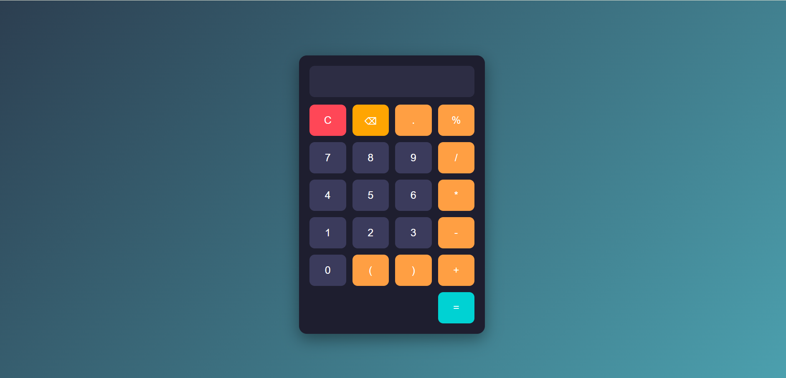

# Calculator Project

A clean and simple calculator built using HTML, CSS, and JavaScript.

## 🚀 Features
- Basic operations (+, -, *, /, %)
- Keyboard support
- Delete and clear functions
- Responsive UI

## 🛠️ Technologies
- HTML
- CSS
- JavaScript

## 📸 Preview

## 🔗 Live Demo
(You will add this after deploying)
